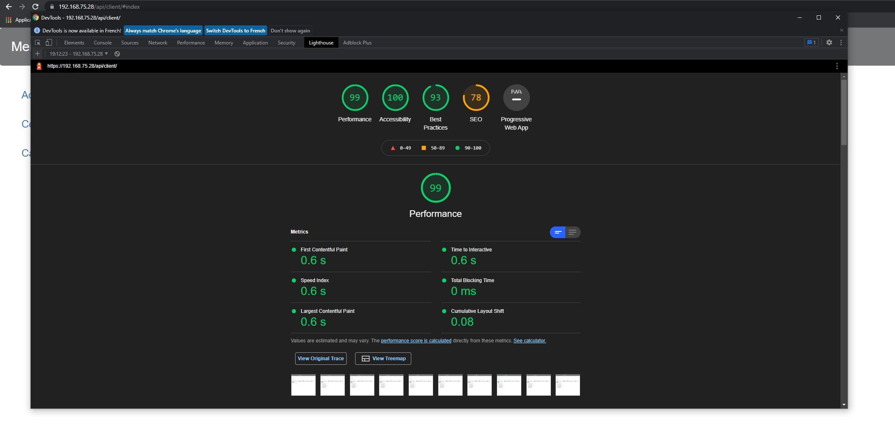
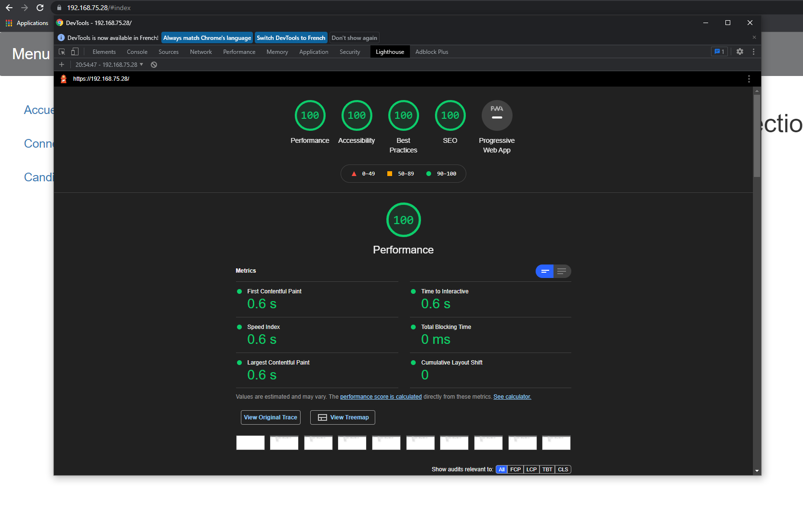

# TP2
## Description
Après la mise en place et la configuration de notre VM, il nous est demandé de mettre en place une application avec les technologies de programmation côté serveur en Java.
Cette application aura pour but de servir de plateforme de vote pour une élection, ce qui pose bien évidemment des questions de confidentialité, entre autres :
Qui a le droit de voir le vote de qui ? Qui a le droit d'accéder à quel page ?
Dans ce tp nous avons développé une application Web qui se veut réaliste tout en suivant les directives du tp.

## Conception et réalisation de l'application
Durant la partie de la conception nous avons dans un premier temps configuré nos `JSP` de manière à gérer les redirections,
les accès aux pages, mais aussi dans le `Ballots.jsp`faire la vérification :
Si l'utilisateur est connecté, mais n'a pas voté, ballot.jsp affichera un message en informant l'utilisateur.
`<c:when test="${sessionScope.user != null && ballots.get(sessionScope.user.login) == null}">`

En plus de cela nous avons utilisé les `Servlets` pour traiter les informations renvoyées par les `JSP`.
Notons que pour le Servlet `Deco` est chargé de déconnecter l'utilisateur en supprimant ses attributs de session et de le renvoyer vers la page d'accueil
avec : `response.sendRedirect("index.html");`

La dernière partie de la conception a consisté à faire le refactoring, l'amélioration des fonctionnalités et la gestion des erreurs.
Pour ajouter le `Vote Blanc` nous avons choisi premièrement de modifier le type de la
liste de candidats en passant d'une HashMap à une LinkedHashMap. De cette manière
nous pouvons ajouter à la fin de celle-ci le candidat `Vote Blanc` afin qu'il
apparaisse en fin de liste dans la page des résultats ainsi que dans la liste de choix
des candidats.

Nous avons aussi ajouté le fait qu'un utilisateur ayant déjà voté ne puisse pas revoter
en affichant un message personnalisé qui propose une redirection sur ballot.jsp.

L'encoding UTF-8 est défini dans le fichier web.xml.


## Intégration continue et déploiement sur votre VM
avant de déployer notre application via l'intégration continue on est passé par plusieurs étapes,
- un build du projet,
- compilation du code,
- et la création du package.
---
**Déploiement VM:** [https://192.168.75.28/api/v1/index.html](https://192.168.75.28/api/v1/index.html)

---
# TP3
## Description
Dans ce TP qui est la suite logique de la précédente il sera question de continuer l'amélioration du code en
s'inspirant des notions vues au cours mais aussi des designs patterns étudié en MIFO1.
Dans une seconde partie nous avons utilisé le protocole HTTP pour améliorer
les performances de votre application.

## Gestion du cache
La gestion du cache est une part importante de HTTP. En effet, HTTP étant utilisé sur des réseaux peu fiables,
la gestion du cache permet d'améliorer les performances ou de palier à des défaillances. Si un élément intermédiaire du réseau,
ou même le client, dispose d'un système de mise en cache, il peut l'utiliser s'il sait que les données qu'il contient sont à jour ou si le serveur distant est temporairement indisponible.

### Utilisation des en-têtes HTTP de date
les en-têtes HTTP sont utilisés pour transmettre des informations supplémentaires avec une réponse HTTP ou une requête HTTP.Date
L’en-tête HTTP contient la date et l’heure auxquelles le message a été généré.
Cela permet de ne pas renvoyer une données si elle n'a pas été modifiée depuis le dernier `GET`:
- Lors de requêtes `POST` on met à jour le champ date:
  `getServletContext().setAttribute("date", date.getTime());`
- Dans le cas d'une requête `GET` :
  . on génère un en-tête de réponse Last-Modified,
  . si la requête contient un en-tête If-Modified-Since, on le compare avec la variable d'instance.

### Utilisation d'Entity Tags (ETag)
L'en-tête de réponse ETag HTTP est un identifiant pour une version spécifique d'une ressource.
Il permet au cache d'être plus efficace et d'économiser de la bande passante, du fait que le serveur Web n'a pas besoin
d'envoyer une réponse complète si le contenu n'a pas changé. Sinon, si le contenu a changé, les etags sont utiles pour
empêcher les mises à jour simultanées d'une ressource de s'écraser mutuellement.
Dans notre cas on l'utilise pour faire la différence entre un utilisateur connecté et un utilisateur non connecté, Notamment pour afficher
la page `Résultats`.
---
**Déploiement VM:** [https://192.168.75.28/api/v2/index.html](https://192.168.75.28/api/v2/index.html)

---
# TP4

Pour ce TP, nous avons choisi de conserver le code du TP3, mais nous avons aussi réutilisé le code
donné par Mr. Médini, notamment pour les différents filtres.


## MVC et controllers
### Controllers Principaux
Comme indiqué dans le TP, le backend est agréé de deux controllers principaux, qui ont pour rôle
de router les requêtes qui démarrent soit par `/election`, ou par `/users`. Ces controllers possèdent
chacun des méthodes permettant de déléguer des requêtes GET, POST, PUT et DELETE. Pour pouvoir envoyer
les requêtes aux controllers souhaités, nous avons mappé les URLs attendus avec les controllers qui y
sont associés. De cette manière, lorsqu'on souhaite ajouter/modifier une route, il suffit de modifier le
contenu de la map.

### Controllers Délégués
Les controllers délégués se comportent tous de la même manière. Ils comportent, eux aussi, des méthodes
qui traitent les GET, POST... mais c'est ici que sont traités les URLs cas par cas. Pour identifier les URLs,
nous avons fait une méthode générique utilisée par tous les controllers qui permet de découper les URLs en
une liste de mots. Le traitement et fait alors au cas par cas en fonction des mots reconnus dans ces URLs.

### Gestion de l'anonymat
Lors de la création d'un ballot, un id est associé à celui-ci via une map. Une seconde map permet
d'associer l'id du ballot et le login de l'utilisateur qui a voté. De cette manière, nous pouvons
savoir si un utilisateur a voté et modifier la valeur de ce vote dans le backend sans dévoiler au front
l'identité du candidat. Et inversement, on peut connaitre le nombre de votes pour chaque candidat sans
savoir qui a voté pour eux.
```
Map1<idBallot, Ballot>
Map2<User, idBallot>
```

## Filtres et Authentification Stateless
Certaines requêtes nécessitent d'être identifié. Ces requêtes passent alors par le filtre approprié qui
vérifie la validité du token, ainsi que sa présence dans la liste des tokens expirés (dans le cas d'un
logout par exemple).

Les requêtes qui nécessitent d'être admin passent aussi par un autre filtre, ou dans certains cas particuliers,
la vérification est faite dans les controllers.

## Négociation de contenu
En fonction de la requête, une réponse et un status approprié sont inscrits dans le contexte de la requête.
En effet, dans le cadre de la négociation de contenu qui se fait à la fin du traitement des requêtes,
nous venons récupérer diverses informations dans le contexte de la requête pour répondre correctement.
Nous venons notamment chercher le DTO, la vue, le code de réponse, le message de réponse et le contenu
à mettre dans le header location. Le traitement est alors fait en fonction de ces éléments, ainsi qu'en
fonction du content-type de la requête, nous sommes alors capable de répondre avec des données en JSON (par défaut)
, XML ou HTML au choix.

Nous faisons appel à deux méthodes générique, buildJSON et buildXML, qui se trouve dans le fichier
utils/APIResponseUtils.java pour générer nos réponses, ou nous incluons la vue (JSP) au `getRequestDispatcher`
pour les réponses HTML.

Nous avons aussi corrigé les JSP pour que le projet compile sans problème, bien qu'on ne puisse pas dépasser
la page de login car le token ne persiste pas dans les requêtes. L'API reste du moins totalement fonctionnelle
lorsque les requêtes sont faites via des outils comme Postman ou Talented API.

## Hypermédia
Toutes les requêtes qui le nécessites renvoient des liens comme précisé dans la documentation de l'API.
La précision du header `Location` lors de la création d'une ressource est gérée dans le filtre de négociation de contenu.
---
**Déploiement VM:** [https://192.168.75.28/api/v3/index.html](https://192.168.75.28/api/v3/index.html)

---
# TP5

## 2.1 Single-Page Application
- Dans ce script nous trouvons une méthode qui sert de fonction de routage. En fonction du hash affiché dans l'url,
la section associée est affichée.
- Le menu dépliant fonctionne correctement.
- L'édition de texte était possible sans qu'on ajoute la ligne préconisée dans le sujet, nous avons décidé
  de la retirer car nous voulions pouvoir `disable` certain éléments du site.  
  En effet dans la section `#ballot`, en plus d'afficher un message personnalisé en fonction de l'état du ballot de
  l'utilisateur connecté, le bouton `supprimer vote` est disabled si l'utilisateur n'as pas voté.
- Les vues sont personnalisées et certaines fonctionnalités bloquées en fonction de différents critères (utilisateur
 connecté ou non, ayant voté ou non).

## 2.2 Templating
Dans le fichier index.html, nous faisons appel à plusieurs CDN:
- Mustache
- Handlebars
- jQuery
- Bootstrap

Les différentes templates sont précompilées grâce à Mustache et rendered grâce à Mustache.  
Dans le cas de l'affichage des candidats, le comportement est différent dans le cas où l'utilisateur est connecté ou non,
nous avons donc ajouté un élément aux données que l'on récupère et le traitement est fait en fonction de la présence ou non de cette donnée.
```
{{#.}}
{{#connecte}}
   <li><a href="#candidats/{{nom}}">{{nom}}</a></li>
{{/connecte}}
{{^connecte}}
   <li>{{nom}}</li>
{{/connecte}}
{{/.}}
```

Nous utilisons la fonction de hash précedemment codée pour déclancher le moteur de templating lorsque c'est nécessaire.

## 2.3 Ajax

La récupération et la modification des données HTML se fait grâce à jQuery, et les requêtes grâce à Ajax.  
Nous utilisons l'API donnée par Mr. Médini pour faire nos requêtes.

Il y a aussi un traitement pour les différents formulaires ainsi que des méthodes auxilières pour permettre la généricité et pour découper le code.

Le formulaire de login et de changement de nom passent par une fonction de validation qui vérifie si les champs ont bien été saisi, et qui,
dans le cas contraire, affiche une alerte et met en évidence les input du formulaire.
Une autre fonction permet de réinitialiser le style des inputs lorsque l'utilisateur les modifies.
---
**Déploiement VM:** [https://192.168.75.28/api/client/index.html](https://192.168.75.28/api/client/index.html)

---
# TP7

## 1- Déploiement sur Tomcat
- **HTML**:  20.19 ms
- **APP Shell**:  178.97 ms
- **CRP**:  253.19 ms

## 2- Déploiement sur Nginx
- **HTML**:  20.30 ms **Amélioration**: 0%
- **APP Shell**:  50.34 ms **Amélioration**: 87.05%
- **CRP**:  128.3 ms **Amélioration**: 50.67%

## 3- Optimisation
### 3.1- CDN
- Toutes les librairies sont déjà importées grâce au **CDN**

### 3.2- ASYNC
- **HTML**:  18.89 ms **Amélioration**: 7.49%
- **APP Shell**:  50.07 ms **Amélioration**: 0.53%
- **CRP**:  129.89 ms **Amélioration**: 0%

### 3.3- Minification et Refactoring
Nous utilisons déjà le minimum de ressources.
Nous utilisons un Minified Boostrap et aucune image.
Nous avons changé la version de Mustache pour une version minified.
- **HTML**:  18.76 ms **Amélioration**: 0.6%
- **APP Shell**:  50.31 ms **Amélioration**: 0%
- **CRP**:  131 ms **Amélioration**: 0%

Il y a très peu de changements car nous avions très peu de ressources critiques
et l'optimisation de Mustach en minify ne fait gagner que quelques kilo octets.

## 4- Photos avec Google Lighthouse

---
**Tomcat:** [https://192.168.75.28/api/client/#index](https://192.168.75.28/api/client/#index)  
**Nginx:** [https://192.168.75.28/#index](https://192.168.75.28/#index)

---
### 4.1. Avant


### 4.2. Après
